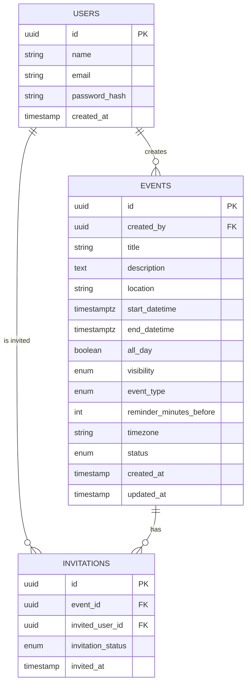
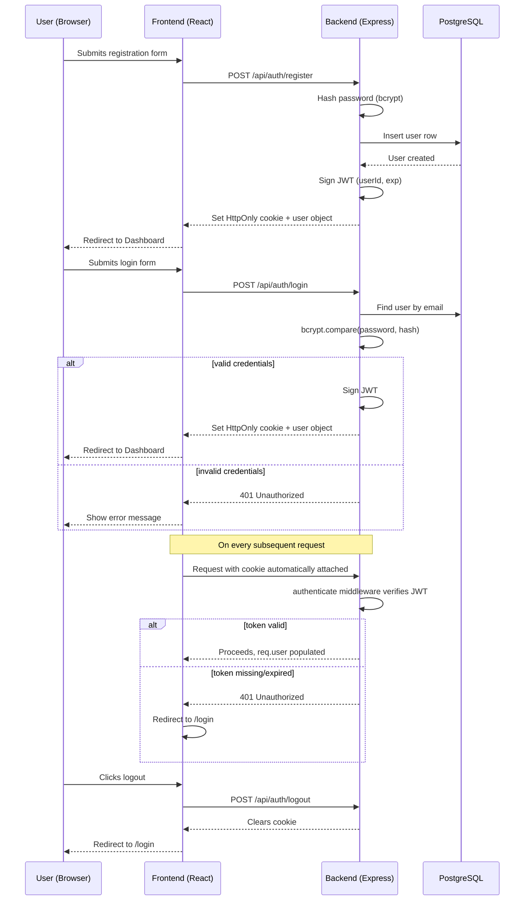
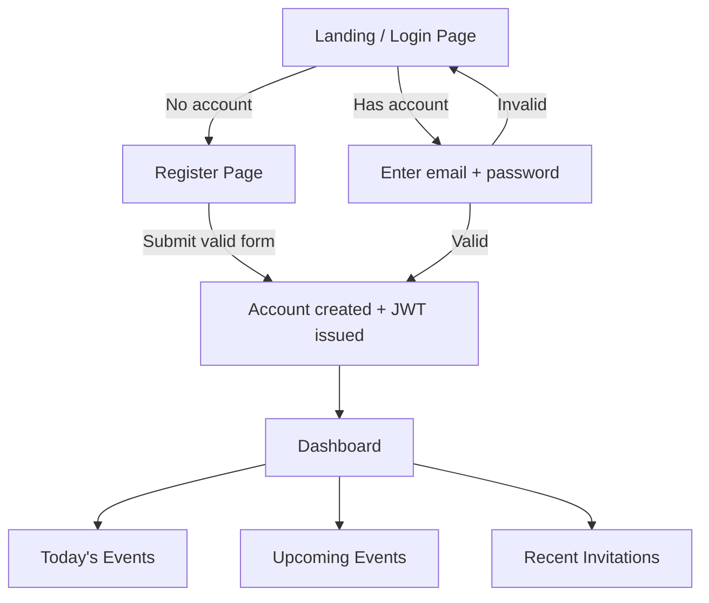
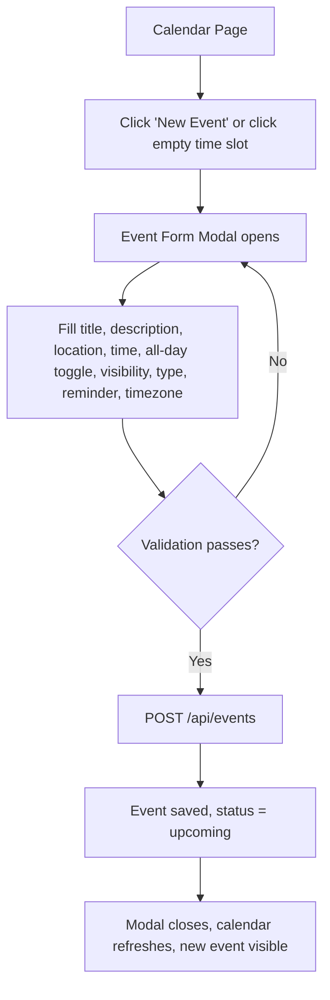
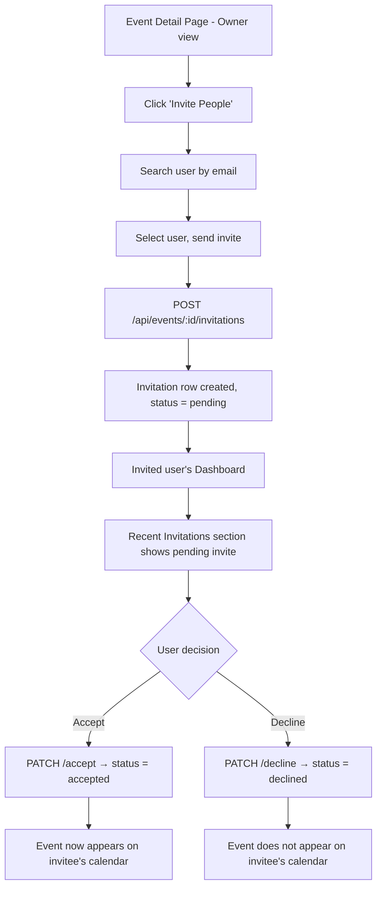
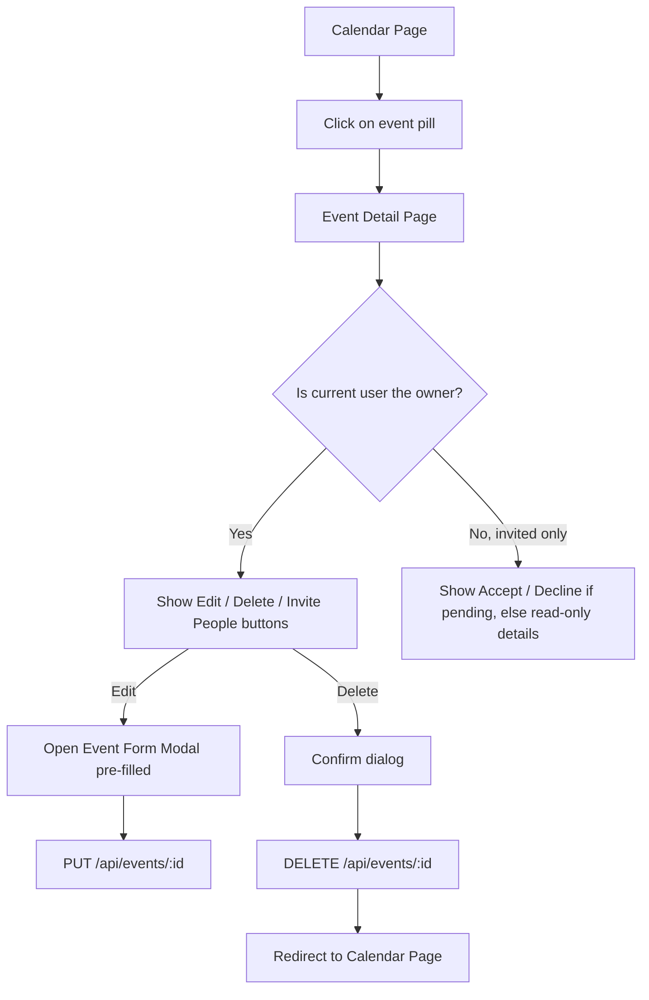

# Personal Calendar Manager — Architecture Design

This document is the design blueprint for the app, before any code is written. It covers the database schema, folder structure, API routes, entity relationships, authentication flow, and user flows. Once you've reviewed and approved this, we move to implementation, screen by screen.

---

## 1. Tech Stack Summary

| Layer | Choice |
|---|---|
| Frontend | React + TypeScript (Vite) |
| Styling | Tailwind CSS |
| Backend | Node.js + Express + TypeScript |
| ORM | Prisma |
| Database | PostgreSQL |
| Auth | JWT (access token) + bcrypt for password hashing |

---

## 2. Database Schema

### 2.1 `users`

| Column | Type | Notes |
|---|---|---|
| id | UUID (PK) | default `gen_random_uuid()` |
| name | VARCHAR(100) | not null |
| email | VARCHAR(255) | unique, not null |
| password_hash | VARCHAR(255) | not null, bcrypt hash |
| created_at | TIMESTAMP | default `now()` |

### 2.2 `events`

| Column | Type | Notes |
|---|---|---|
| id | UUID (PK) | default `gen_random_uuid()` |
| created_by | UUID (FK → users.id) | not null, `ON DELETE CASCADE` |
| title | VARCHAR(255) | not null |
| description | TEXT | nullable |
| location | VARCHAR(255) | nullable |
| start_datetime | TIMESTAMPTZ | not null |
| end_datetime | TIMESTAMPTZ | not null |
| all_day | BOOLEAN | default `false` |
| visibility | ENUM(`private`, `invited_only`, `public`) | default `private` |
| event_type | ENUM(`work`, `personal`, `family`, `health`, `social`, `other`) | maps to a colour in the UI |
| reminder_minutes_before | INTEGER | nullable, e.g. 10, 30, 60, 1440 |
| timezone | VARCHAR(64) | IANA tz string, e.g. `Europe/London` |
| status | ENUM(`upcoming`, `completed`, `cancelled`) | default `upcoming` |
| created_at | TIMESTAMP | default `now()` |
| updated_at | TIMESTAMP | auto-updated |

**Indexes:** `created_by`, `(start_datetime, end_datetime)` for range queries, `status`.

### 2.3 `invitations`

| Column | Type | Notes |
|---|---|---|
| id | UUID (PK) | default `gen_random_uuid()` |
| event_id | UUID (FK → events.id) | not null, `ON DELETE CASCADE` |
| invited_user_id | UUID (FK → users.id) | not null, `ON DELETE CASCADE` |
| invitation_status | ENUM(`pending`, `accepted`, `declined`) | default `pending` |
| invited_at | TIMESTAMP | default `now()` |

**Unique constraint:** `(event_id, invited_user_id)` — a user can only be invited once per event.
**Indexes:** `invited_user_id` (for "my invitations" queries), `event_id`.

> `status` calculation note: rather than a background job, `status` on `events` is best treated as **derived** for "upcoming/completed" (computed from `end_datetime` vs now at query time) and only **stored** for the explicit `cancelled` state. This avoids stale data. We'll decide together when we implement — flagging it now so it's not a surprise later.

---

## 3. Entity Relationships



**Relationship summary:**
- One **user** → many **events** (as creator/owner).
- One **user** → many **invitations** (as invitee).
- One **event** → many **invitations** (one per invited user).
- `events.visibility = public` is a hint for future "shareable calendar" features, but for v1, visibility mainly controls whether non-invited users can ever see the event at all (private = only owner, invited_only = owner + invitees, public = anyone with the link — stubbed for now).

---

## 4. Folder Structure

### 4.1 Backend (`/server`)

```
server/
├── prisma/
│   ├── schema.prisma
│   └── migrations/
├── src/
│   ├── config/
│   │   └── env.ts                # loads & validates env vars
│   ├── modules/
│   │   ├── auth/
│   │   │   ├── auth.controller.ts
│   │   │   ├── auth.service.ts
│   │   │   ├── auth.routes.ts
│   │   │   └── auth.validation.ts
│   │   ├── users/
│   │   │   ├── users.controller.ts
│   │   │   ├── users.service.ts
│   │   │   ├── users.routes.ts
│   │   │   └── users.validation.ts
│   │   ├── events/
│   │   │   ├── events.controller.ts
│   │   │   ├── events.service.ts
│   │   │   ├── events.routes.ts
│   │   │   └── events.validation.ts
│   │   └── invitations/
│   │       ├── invitations.controller.ts
│   │       ├── invitations.service.ts
│   │       ├── invitations.routes.ts
│   │       └── invitations.validation.ts
│   ├── middleware/
│   │   ├── authenticate.ts       # verifies JWT, attaches req.user
│   │   ├── errorHandler.ts
│   │   └── validateRequest.ts    # generic zod/Joi validation middleware
│   ├── lib/
│   │   ├── prisma.ts             # Prisma client singleton
│   │   └── jwt.ts                # sign/verify helpers
│   ├── utils/
│   │   └── apiResponse.ts        # consistent success/error response shape
│   ├── app.ts                    # express app, middleware wiring
│   └── server.ts                 # entrypoint, starts the listener
├── .env.example
├── package.json
└── tsconfig.json
```

This is a **feature-module** structure (auth, users, events, invitations each self-contained), which scales better than splitting purely by technical layer once the app grows.

### 4.2 Frontend (`/client`)

```
client/
├── src/
│   ├── api/
│   │   ├── axiosClient.ts        # base axios instance, attaches JWT, handles 401
│   │   ├── auth.api.ts
│   │   ├── events.api.ts
│   │   └── invitations.api.ts
│   ├── components/
│   │   ├── calendar/
│   │   │   ├── MonthView.tsx
│   │   │   ├── DayView.tsx
│   │   │   └── EventPill.tsx
│   │   ├── events/
│   │   │   ├── EventFormModal.tsx
│   │   │   ├── EventDetailPanel.tsx
│   │   │   └── ReminderSelect.tsx
│   │   ├── invitations/
│   │   │   ├── InviteUserSearch.tsx
│   │   │   └── InvitationCard.tsx
│   │   ├── dashboard/
│   │   │   ├── TodayEvents.tsx
│   │   │   ├── UpcomingEvents.tsx
│   │   │   └── RecentInvitations.tsx
│   │   └── ui/                   # generic buttons, inputs, modal shell, etc.
│   ├── pages/
│   │   ├── LoginPage.tsx
│   │   ├── RegisterPage.tsx
│   │   ├── DashboardPage.tsx
│   │   ├── CalendarPage.tsx
│   │   ├── EventDetailPage.tsx
│   │   └── ProfilePage.tsx
│   ├── context/
│   │   └── AuthContext.tsx       # current user, login/logout, token storage
│   ├── hooks/
│   │   ├── useEvents.ts
│   │   ├── useInvitations.ts
│   │   └── useAuth.ts
│   ├── routes/
│   │   ├── AppRoutes.tsx
│   │   └── ProtectedRoute.tsx
│   ├── types/
│   │   ├── event.types.ts
│   │   ├── user.types.ts
│   │   └── invitation.types.ts
│   ├── utils/
│   │   └── dateHelpers.ts
│   ├── App.tsx
│   └── main.tsx
├── .env.example
├── tailwind.config.ts
└── package.json
```

---

## 5. API Routes

All routes prefixed with `/api`. Protected routes require `Authorization: Bearer <token>`.

### Auth

| Method | Route | Description | Protected |
|---|---|---|---|
| POST | `/api/auth/register` | Create account | No |
| POST | `/api/auth/login` | Login, returns JWT | No |
| POST | `/api/auth/logout` | Invalidate session client-side | Yes |

### Users

| Method | Route | Description | Protected |
|---|---|---|---|
| GET | `/api/users/me` | Get current user's profile | Yes |
| GET | `/api/users/search?email=` | Search users by email (for invites) | Yes |

### Events

| Method | Route | Description | Protected |
|---|---|---|---|
| GET | `/api/events` | List events for current user (owned + invited-accepted), supports `?start=&end=` range filter | Yes |
| GET | `/api/events/:id` | Get single event detail | Yes |
| POST | `/api/events` | Create event | Yes |
| PUT | `/api/events/:id` | Update event (owner only) | Yes |
| DELETE | `/api/events/:id` | Delete event (owner only) | Yes |

### Invitations

| Method | Route | Description | Protected |
|---|---|---|---|
| POST | `/api/events/:id/invitations` | Invite a user to an event | Yes |
| GET | `/api/invitations/received` | List invitations sent to current user | Yes |
| PATCH | `/api/invitations/:id/accept` | Accept invitation | Yes |
| PATCH | `/api/invitations/:id/decline` | Decline invitation | Yes |

### Dashboard (convenience aggregate)

| Method | Route | Description | Protected |
|---|---|---|---|
| GET | `/api/dashboard` | Returns today's events, upcoming events, and recent invitations in one payload | Yes |

---

## 6. Authentication Flow

**Strategy:** stateless JWT, stored in an HttpOnly cookie (more secure than `localStorage` against XSS) with a short expiry, e.g. 7 days.



**Key decisions worth confirming with you before coding:**
- Cookie-based JWT (HttpOnly, `SameSite=Lax`, `Secure` in production) rather than `localStorage`, to reduce XSS token-theft risk. This means CORS config needs `credentials: true` on both ends.
- `authenticate` middleware on the backend rejects with `401` if token missing/invalid/expired — no silent refresh in v1 (user just logs in again). We can add refresh tokens later if needed.
- Passwords hashed with bcrypt, salt rounds = 10–12.

---

## 7. User Flow Diagrams

### 7.1 Registration → Login → Dashboard



### 7.2 Creating an Event



### 7.3 Inviting & Responding to Invitations



### 7.4 Viewing & Editing an Event



---

## 8. What's Next

Once you confirm this design works for you, the build order I'd suggest is:

1. **Backend foundation** — Prisma schema, migrations, Express app skeleton, env config.
2. **Auth module** — register, login, logout, JWT middleware.
3. **Events module** — CRUD + validation.
4. **Invitations module** — invite, accept, decline, search users.
5. **Dashboard aggregate endpoint.**
6. **Frontend foundation** — routing, auth context, protected routes, Tailwind setup.
7. **Auth pages** — Login, Register.
8. **Calendar pages** — Month view, Day view.
9. **Event modal + detail page.**
10. **Invitations UI + Dashboard page.**

Let me know if you'd like any part of this design changed — for example, a different auth storage strategy, additional event fields, or recurring events support (not in the current requirements, but common in calendar apps) — before we start writing code.
